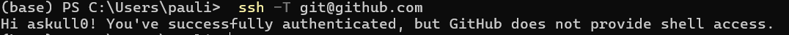
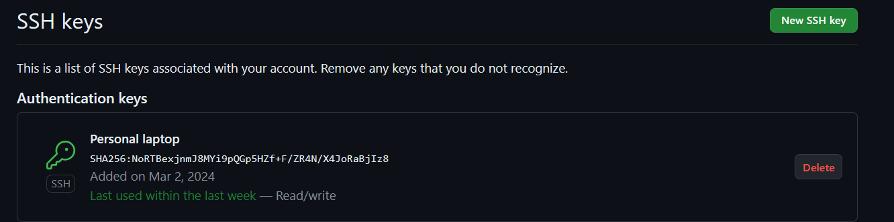
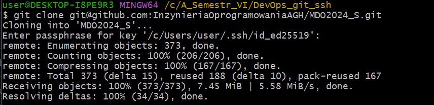
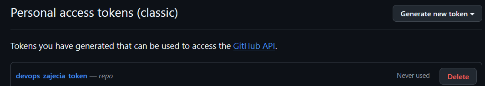
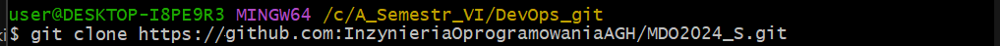
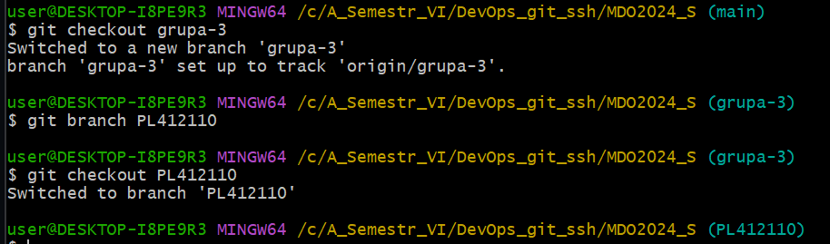
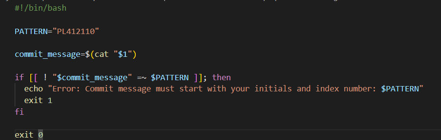
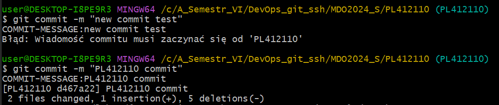
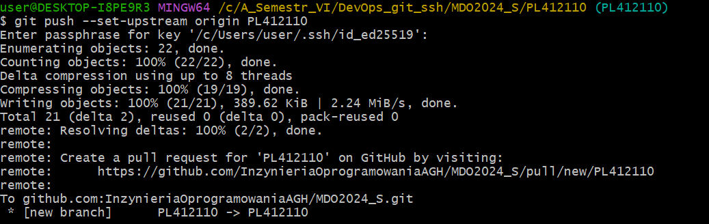
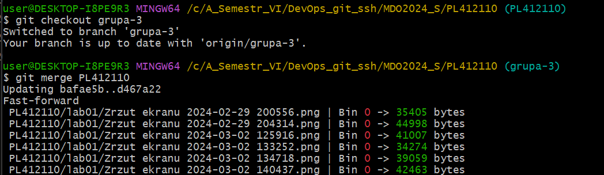

# Zajęcia 01
---
# Wprowadzenie, Git, Gałęzie, SSH

## Zadania do wykonania
1. Zainstaluj klienta Git i obsługę kluczy SSH

    - Instalacja i uruchomienie uslugi SSH, w celu nawiązywania bezpiecznego połaczenia przez protokół SSH oraz możliwość zarządzania kluczami
    

    - uruchomienie usługi                                                                                
    

2. Upewnij się w kwestii dostępu do repozytorium jako uczestnik i sklonuj je za pomocą utworzonego klucza SSH (zapoznaj się z https://docs.github.com/en/authentication/connecting-to-github-with-ssh/generating-a-new-ssh-key-and-adding-it-to-the-ssh-agent)  
    - Utwórz dwa klucze SSH, inne niż RSA, w tym co najmniej jeden zabezpieczony hasłem  
      
    - dodanie klucza do ssh-agent:    
    

    - sprawdzenie połaczenia:                               
    

   - Skonfiguruj klucz SSH jako metodę dostępu do GitHuba                   
    dodanie klucza publicznego do githuba:
    
   - Sklonuj repozytorium z wykorzystaniem protokołu SSH                                                    
    

3. Sklonuj repozytorium https://github.com/InzynieriaOprogramowaniaAGH/MDO2024_S za pomocą HTTPS i personal access token. (https://docs.github.com/en/authentication/keeping-your-account-and-data-secure/managing-your-personal-access-tokens)

    - wygenerowanie tokenu PAT                          
    
    - sklonowanie repo  
    


4. Przełącz się na gałąź ```main```, a potem na gałąź swojej grupy oraz utwórz gałąź o nazwie "inicjały & nr indeksu" np. ```KD232144```.
    

6. Rozpocznij pracę na nowej gałęzi

   - W katalogu właściwym dla grupy utwórz nowy katalog, także o nazwie "inicjały & nr indeksu" np. ```KD232144```
   - Napisz Git hook'a - skrypt weryfikujący, że każdy Twój "commit message" zaczyna się od "twoje inicjały & nr indexu". (Przykładowe githook'i są w folderze .git/hooks w repo na twoim dysku)

    

   - Skopiuj go we właściwe miejsce, tak by uruchamiał się za każdym razem kiedy robisz commita.                            
    Umieszczono git hook'a - prepare-commit-msg, w katalogu .git/hooks                                                                  
        - sprawdzenie działania hook'a:                                           
                                           
   - Wyślij zmiany do zdalnego źródła, git push z opcją --set-upstream określa, którą gałąź zdalną powinien śledzić lokalny branch.                   
                              
   - Spróbuj wciągnąć swoją gałąź do gałęzi grupowej                                            
    
   - Zaktualizuj sprawozdanie i zrzuty o ten krok i wyślij aktualizację do zdalnego źródła (na swojej gałęzi)
        - wykonane komendy: git add, git commit, git push 
    
7. Wystaw Pull Request do gałęzi grupowej