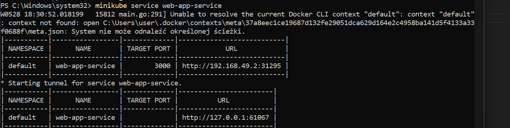
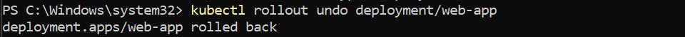

# Zajęcia 10

# Wdrażanie na zarządzalne kontenery: Kubernetes (2)
### Konwersja wdrożenia ręcznego na wdrożenie deklaratywne YAML
 * Upewnij się, że posiadasz wdrożenie z poprzednich zajęć zapisane jako plik YAML
 
 
 * Wzbogać swój obraz o +4 repliki względem poprzednich zajęć
    -->  replicas:5
 * Rozpocznij wdrożenie za pomocą ```kubectl apply```
 
 * Zbadaj stan za pomocą ```kubectl rollout status```
 
 
 
 

### Przygotowanie nowego obrazu
 * Upewnij się, że dostępne są dwie wersje obrazu z wybranym programem (np.: 1.0 oraz 1.1)

 * Przygotuj dodatkową wersję obrazu, którego uruchomienie specjalnie kończy się błędem
 
 
 
 Uruchomienie kontenera zakonczyłowi sie błedem:
 

 Poniewaz obraz był z bładem trzeba wrzucic go recznie 
 
 
  
### Zmiany w deploymencie
 * Aktualizuj plik YAML z wdrożeniem i przeprowadzaj wdrożenie ponownie ponownie po zastosowaniu następujących zmian:
   1. dwukrotne zwiększenie liczby replik
    
   
   1. zmniejszenie liczby replik do 1
   
   1. zmniejszenie liczby replik do 0

   1. Zastosowanie nowej wersji obrazu
   
   
   1. Zastosowanie starszej wersji obrazu
   
   

   z bledem
   
   

 * Przywracaj poprzednie wersje wdrożeń za pomocą poleceń
   1. ```kubectl rollout history```  - wyswietlenie historii
   
   1. ```kubectl rollout undo```




### Kontrola wdrożenia
 * Napisz skrypt weryfikujący, czy wdrożenie "zdążyło" się wdrożyć (w ciągu 60 sekund) - jak można to sprawdzić?
 
 


