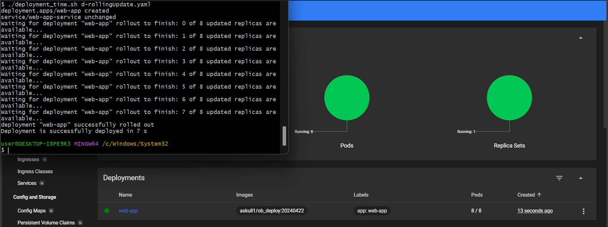
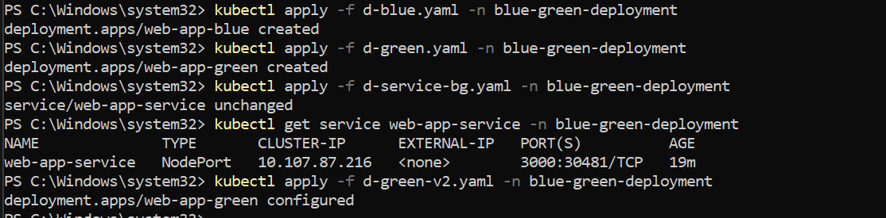

# Zajęcia 11

# Wdrażanie na zarządzalne kontenery: Kubernetes (2)

### Strategie wdrożenia
 * zapoznaj się z https://kubernetes.io/docs/concepts/workloads/controllers/deployment/
 * Przygotuj następujące strategie wdrożeń, zmierz czas wykonania wdrożenia każdą z nich
 
 * Zaobserwuj i opisz różnice w czasie wdrożenia i ilości pod'ów. 
   1. Recreate

   Najpierw usuwa istniejące instancje aplikacji, a następnie wdraża nowe. Może powodować przerwy w dostępności aplikacji.

   
   
   
   

   czas: 10s

   1. Rolling Update

   Stopniowa aktulaizacja podow. Ta strategia stopniowo wymienia stare instancje na nowe, utrzymując określoną liczbę działających instancji przez cały czas.  Proces ten jest sekwencyjny, dzięki czemu zawsze są dostępne działające pod-y.
   
   
   
   
   
 
   czas: 14s

   1. Rolling Update (maxUnavailable > 1, maxSurge > 20%)

   Strategia pozwala na większą liczbę jednoczesnych zmian, co może przyspieszyć wdrożenie
   MaxUnavailable i MaxSurge: parametry te kontrolują sposób, w jaki przeprowadzane jest wdrożenie:
    maxUnavailable: Maksymalna liczba podów, które mogą być niedostępne podczas aktualizacji.
    maxSurge: Maksymalna liczba nowych podów, które mogą być uruchomione ponad żądaną liczbę replik podczas aktualizacji.
   
  

   
   

   czas: 9s 
   
   1. Blue/green

   Blue/Green Deployment wymaga dwóch oddzielnych zestawów podów (blue i green), co pozwala na szybkie przełączenie ruchu między wersjami. Ta strategia uruchamia nową wersję aplikacji równolegle z istniejącą wersją, a następnie przełącza ruch do nowej wersji po jej pełnym uruchomieniu.Nowa wersja aplikacji jest wdrażana do środowiska green, a po przetestowaniu ruch jest przekierowywany z blue do green.

   
   

    działania:

   
   

   po czym dodanie  env:green   w service:

   

   oraz zmiana w deployment green na inna wersje:

   

   przebieg wprowadzanego wdrozenia:

   

   apliakcja dzialajaca w green environment:

   

   1. Canary Deployment workload 

   Canary deployment wdraża nową wersję do małej części pod'ów, monitoruje ją, a następnie stopniowo zwiększa tę liczbę. Nowa wersja aplikacji jest wdrażana obok istniejącej wersji, ale obsługuje tylko niewielką część ruchu. Stopniowo zwiększa się ilość ruchu obsługiwanego przez nową wersję. Pozwala na dokładne testowanie nowej wersji z prawdziwymi użytkownikami, dzięki czemu jest łatwa do wykrycia i naprawienia problemów przed pełnym wdrożeniem. 

   
   

   
  
  widac czesc dzialajaca w innej werscji i mniej w czesniejszej wersji:

  
  

 * Odpowiedz: Które wdrożenia były najszybsze? Dlaczego? 
 
 Wdrozenie RollingUpdate z odpowiednimi praemetrami działalo szybicej niz recreate, jednak u mnie to 1s roznicy.
 Recreate zazwyczaj jest najszybsze, ponieważ wszystkie stare pody są usuwane na raz, a nowe są uruchamiane, nie wymaga dodatkowych zasobów. Nie ma tu stopniowego procesu, więc cały cykl może być krótszy, zwłaszcza jeśli nowe pody uruchamiają się szybko.

 Rolling Update z odpoweidnimi parametrami w praktyce tez moze byc bardzo szybkie tak jak u mnie, ponieważ pozwala na równoczesne uruchamianie większej liczby nowych podów i usuwanie starych podów, konkretne parametry pozwalają na równoczesne wykonanie większej liczby operacji, co przyspiesza cały proces wdrożenia, jednocześnie minimalizując przestoje, co jest lepsze ponieważ może spowodować płynne wdrożenie

 Wdrożenia Blue/Green jest bardziej skomplikowane, ale zapewnia dodatkowe korzyści w postaci łatwego rollbacku i minimalizowania ryzyka wdrożenia błędów, ale wmaga podwójnych zasobów, przez co tez nowa wersja może być dokładnie przetestowana w środowisku produkcyjnym bez wpływu na użytkowników.

 Wdrożenie Canary tez jest skomplikowane, ale przez stopniowe wdrażanie pozwala na wczesne wykrycie problemów bez wpływu na wszystkich użytkowników. Wymaga zaawansowanego monitorowania i narzędzi do zarządzania ruchem, ale jest bardziej efektywne pod względem zasobów niż Blue/Green.

plik do mierzenia czasu:

