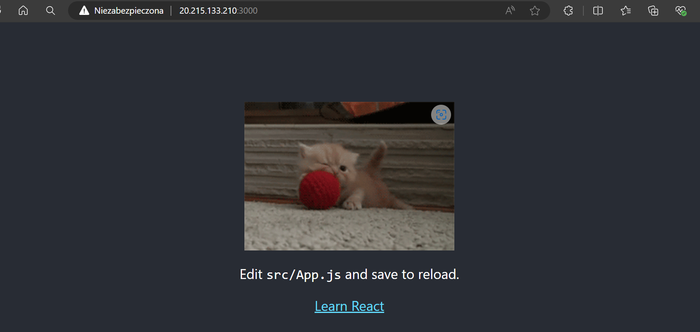

# Zajęcia 12

# Wdrażanie na zarządzalne kontenery w chmurze

### Przygotowanie kontenera
 - Proszę upewnić się, że dysponuje się własnym kontenerem z aplikacją
 - Proszę zaktualizować wersję kontenera obecną na Docker Hub 
 

 
### Zapoznanie z platformą
 - Konto do odblokowania za pomocą studenckiego konta Microsoft:
   https://azure.microsoft.com/en-us/free/ (personal) lub przez Panel AGH: https://panel.agh.edu.pl/ (student)
 - Cennik do przeczytania (ze zrozumieniem!!):
   https://azure.microsoft.com/en-us/pricing/details/container-instances/ 
 - Azure Cloud Shell dla powłok Bash i PowerShell, narzędzie potrzebne do wdrożenia:
   https://docs.microsoft.com/en-us/azure/cloud-shell/quickstart
 - **Miej na uwadze, że zalogowanie ACS do Azure'a i wołanie az na instancji zużywa kredyty!**
 - Procedura wdrożenia kontenera:
   https://docs.microsoft.com/en-us/azure/container-instances/container-instances-quickstart
 - Przygotowanie aplikacji:
   https://docs.microsoft.com/en-us/azure/container-instances/container-instances-tutorial-prepare-app
 - "Push image to Azure Container Registry" nie jest potrzebne!
 - *"Nie musisz tworzyć Docker Registry w Azure! Twoje obrazy już są na dockerhub'ie!"*

### Zadanie do wykonania
 1. Utwórz własny resource group

 2. Wdróż swój kontener z Docker Hub w swoim Azure
 
 
 
 
 3. Zatrzymaj i usuń kontener (to bardzo ważne!)

 