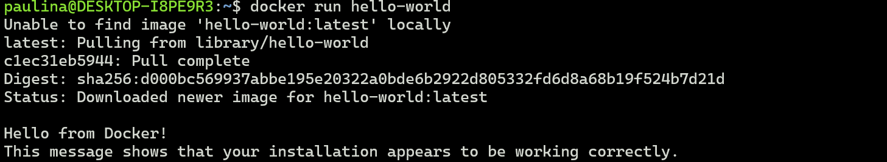

### Sprawozdnaie 2 - Zestawienie środowiska

## Instalacja Dockera w systemie linuksowym
Uzylam WSL2, który juz kiedys instalowalam, 
sprawdzenie wersji, gdyż jest wymgana odpowiednia min. 1.1.3.0:

Dodatkowo instalcja docker desktop, uzywając WSL2:

## Zarejestrowanie się w Docker Hub oraz pobranie ze strony dockerhub obrazow: hello-world, busybox, ubuntu lub fedorę, mysql

## Uruchomienie busybox
Efekt uruchomienia kontenera:
docker run -it --rm busybox

jesli uzyje samego uruchomienia, wyłacza się:

dzieki temu mozemy nie wchodzac do containera uruchomic go przez docker start lub zatrzymac uzywajac docker stop.

Jesli chcemy wejsc do takiego containera mozemy wtedy uzyc polecenia docker exec -it .. /bin/bash

-Aby podłączyć się do kontenera interaktywnie trzeba uzyć opcji -it. Wywołanie numeru wersji:

## Uruchom "system w kontenerze"

Zaprezentuj PID1 w kontenerze i procesy dockera na hoście

Zaktualizowanie pakietow, najpierw polecneiem apt update, ktory sciagnie najnowsze aktualizacje, poczym uzywajac apt upgrade zainstaluje aktualizacje

 Na samym koncu wychodzimy poleceniem "exit"

## Stworznie oraz zbuduwanie i uruchomienie pliku Dockerfile, ktory sklonuj repo

Wykorzystanie zmiennje srodowiskowej, ktora jest wczytywana z pliku.

Zbudowanie obrazu z uzyciem Dockerfile:

Uruchomienie w trybie interaktywnym i weryfikacja czy jest sciagniete repozytorium

## Pokaż uruchomione ( != "działające" ) kontenery, wyczyść je.
 

oraz wyczysczenie containerow docker rm 'nazwa'

## Wyczyczenie obrazow 
docker rmi 'nazwa'

