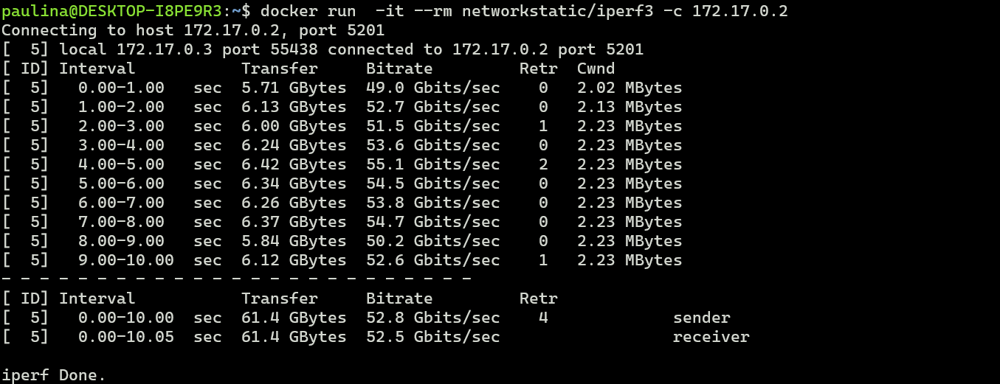

# Dodatkowa terminologia w konteneryzacji, instancja Jenkins

### Zachowywanie stanu (0-2 pkt)
Przygotuwanie woluminow wejściowych i wyjściowych:
 
podłączenie do kontenera bazowego i uruchomienie 

Sklonowanie repozytorium na wolumin wejściowy:

Uruchomienie build w kontenerze

Zapis zbudowanych plikow na woluminie wyjściowym, tak by były dostępne po wyłączniu kontenera.

### Eksponowanie portu (0-2 pkt)

Uruchomienie wewnątrz kontenera serwer iperf (iperf3):

  * Przekierowuje port 5201 z hosta na port 5201 wewnątrz kontenera co pozwala na dostęp do serwera iperf3 uruchomionego w kontenerze z hosta lub z sieci zewnętrznej.
  * -s: Uruchamia serwer iperf3 w trybie serwera.

 Połącz się z nim z drugiego kontenera, zbadaj ruch

 server
 
 client
 

 Połącz się spoza kontenera - z hosta  (prawdopodobnie twój OS)
 server
 
 client
 

 Połącz się spoza kontenera - spoza hosta (prawdopodobnie dalej niż twój OS)
 server
 
 klient
 
 
 Przedstaw przepustowość komunikacji
 * połączenie z drugieggo kontenra -> bitrate: 52.5 Gbits/sec
 * połączenie spoza kontenera (z hosta) -> bitrate: 1.53 Gbits/sec
 * połączenie spoza kontenera (spoza host) -> bitrate: 74.4 Mbits/sec

 wyciągnij log z kontenera:
 

### Instancja Jenkins (0-3 pkt)
Przeprowadź instalację skonteneryzowanej instancji Jenkinsa

tworzenie sieci:

pobranie i uruchomienie obrazu docker:dind:

dostsowanie oficjalnego obrazu Jenkis poprzez:
 - Dockerfile
 
 - Budowanie docker image
 

uruchomienie kontenera z zbudowanego obrazu:

Zainicjalizuj instację

Przechodzimy na adres http://localhost:8080
i uzyskujemy haslo:

instalacja wtyczek:

działające kontenery

pokaż ekran logowania

