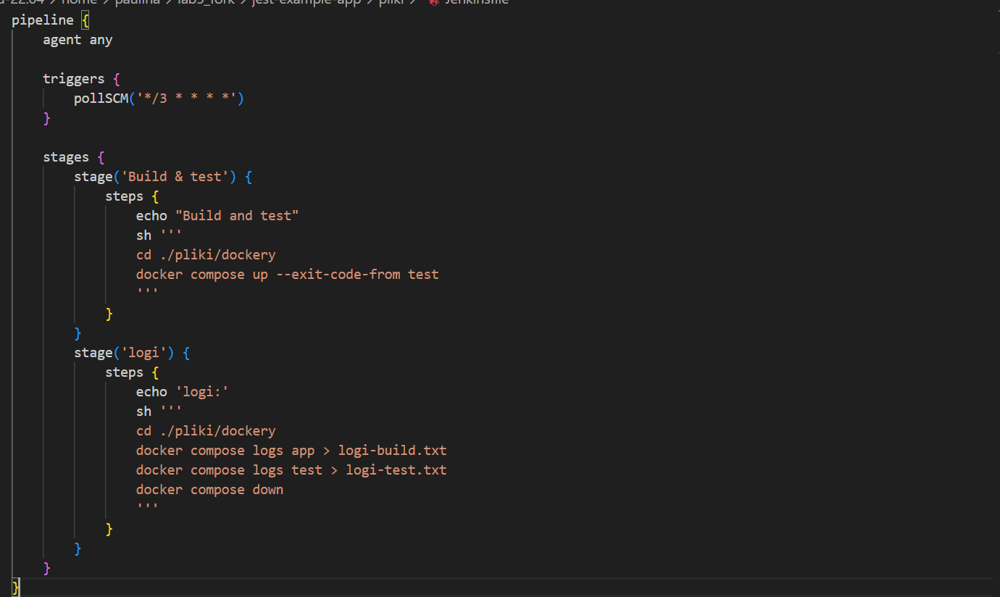
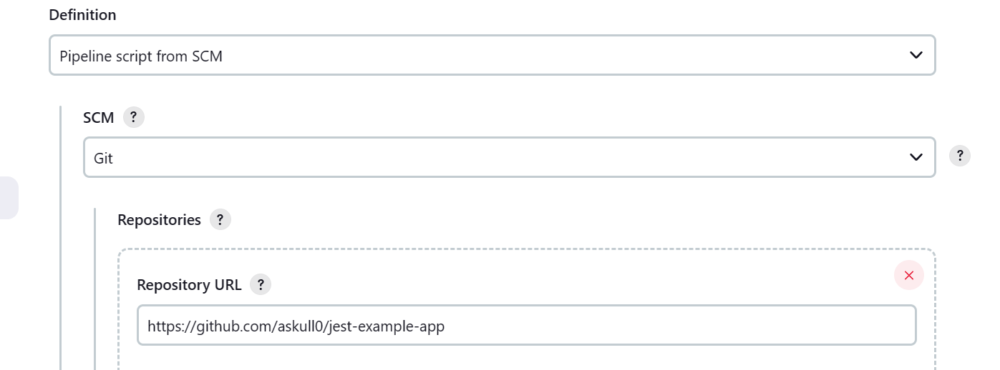

## Pipeline, Jenkins, izolacja etapów

### Przygotowanie

Instalacje jenkisa i kofiguracja wykonana na poprzednic zajaciach.  
  Działający Blueocean:
  
  
### Uruchomienie 
* Konfiguracja wstępna i pierwsze uruchomienie
  * Utwórz projekt, który wyświetla uname, komenda wpisana przy uruchomianiu builda
  
  * Utwórz projekt, który zwraca błąd, gdy godzina jest nieparzysta
  
* Utwórz "prawdziwy" projekt, który:
  * klonuje nasze repozytorium i przechodzi na osobistą gałąź
  
  Wyswietla sie komunikat infomujacy ze mamy prywatne repozytorium i nie mamy danych uweirzytelniających.
  Aby rozwiazać ten problem dodajemy credentials:
  
  wspisujemy nasz login github oraz jako haslo utworzuony wczesniej acces token
  
  oraz okreslamy galaz która będzie budowana:
  
  * buduje wszystkie obrazy z dockerfiles i/lub komponuje via docker-compose z Lab02, Lab03, Lab04, które wczesniej wrzuciłeś na repozytorium
  
  Buildy nie przeszly testow poniewaz nie było zainstalowanego docker compose wiec trzeba było zbudowac obraz jenkisa z dodana komenda: RUN apt-get install docker-compose-plugin
  i sukces:
 

### Pipeline: Zdefiniuj pipeline w Jenkinsie, korzystający z kontenerów, celem realizacji kroków `start trigger -> build` w ogólnym modelu Potoku Wdrożeniowego:
* Wykonaj własny *fork* repozytorium wybranego oprogramowania :

* Wypisz wymagania wstępne środowiska dla tego programu:
yarn,npm,node
* Repo posiada licencja :

* Upewnij się że:
- Przechodzą dołączone do niego testy po uzyciu komendy yarn install:

- Wybrano kontener bazowy lub stworzono odpowiedni kontener wstepny (runtime dependencies)

- Build został wykonany wewnątrz kontenera

- Testy zostały wykonane wewnątrz kontenera

- Kontener testowy jest oparty o kontener build:

- Logi:

Jenkinsfile umieszony w repo (fork), podzielony na sceny w ktorej najpierw buduje i wykonuje testy a pozniej zapisuje logi

Projekt w pipeline:

pipeline wykonujacy wczesniej sprawdzone i działajace buildy, efekt gdy jest uruchomiony recznie oraz przez commit automataycznie (dzieje sie tak porzez triggry)

 		 	
Dzięki pipeline moza automatyzować proces CI/CD, eliminując konieczność ręcznej realizacji etapów. Sprawwia ze taki proces jak budowanie, testowanie i wdrażanie przebiega spojnie. Jenkins umożliwia monitorowanie wykonania pipeline'ów i śledzenie postępów procesu CI/CD.