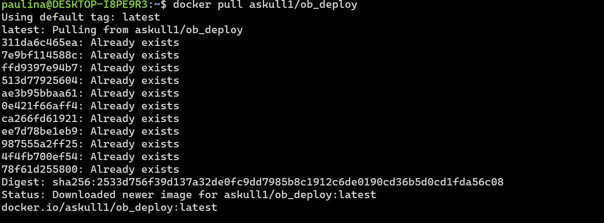

# Sprawozdanie  Pipeline: pełna lista kontrolna

## Przpomnienie - ścieżka krytyczna
Podstawowy zbiór czynności do wykonania w ramach zadania z pipelinem CI/CD. Ścieżką krytyczną jest:
- [x] commit (lub manual trigger @ Jenkins) - już omawiane w Lab05
- [x] clone - już omawiane w Lab05
- [x] build - już omawiane w Lab05
- [x] test - już omawiane w Lab05
- [ ] deploy
- [ ] publish

### Pełna lista kontronla rzeczy do uwzględnienia w pipeline
#### Z Lab05:
- [x] Aplikacja została wybrana
- [x] Licencja potwierdza możliwość swobodnego obrotu kodem na potrzeby zadania
- [x] Wybrany program buduje się
- [x] Przechodzą dołączone do niego testy
- [x] Zdecydowano, czy jest potrzebny fork własnej kopii repozytorium
- [x] Wybrano kontener bazowy lub stworzono odpowiedni kontener wstepny (runtime dependencies)
- [x] Build został wykonany wewnątrz kontenera
- [x] Testy zostały wykonane wewnątrz kontenera
- [x] Kontener testowy jest oparty o kontener build
- [x] Logi z procesu są odkładane jako numerowany artefakt

Wykonane na poprzednich zajeciach.

### Diagramy UML
- [ ] Stworzono diagram komunikacji UML (communication diagram) zawierający sekwencję dla procesu CI/CD, który wykonujesz

- [ ] Stworzono diagram wdrożeniowy UML (deployment diagram) zawierający sekwencję dla procesu CI/CD, który wykonujesz

#### Z Lab06:
Działajce wczesniej stworzone kontenery blueocean oraz DIND

- Zdefiniowano kontener 'deploy' służący zbudowanej aplikacji do pracy

a wiec kontener buildowy trzeba było zmienic:

w pipeline:

oraz dodanie skryptu, który usuwa poprzednie zbudowane kontenery i obrazy

na podstawie skryptu:

- Wersjonowany kontener 'deploy' ze zbudowaną aplikacją jest wdrażany na instancję Dockera

Poniewaz aplikacja jest uruhacmiana poprzez DIND, udtsepiony port dziala w innej sieci wiec nie moge zoabczyc w przeglądarce efktu dziala aplikacji, ale testy przeprowadzane w środku działają.

- Zdefiniowano, jaki element ma być publikowany jako artefakt: kontener z programem

- Dostępność artefaktu: publikacja do Rejestru online (dockerhub)
Najpierw trzeba było stworzyć PAT

pipeline odpowiadajacy za tą publikacje

wersjonanowanie odbywa sie z dziejsza data

pobranie obrazu z dockerhub

oraz zbudowanie i uruchomienie kontenera na ejgo podstawie:

oraz efekt dzialania

