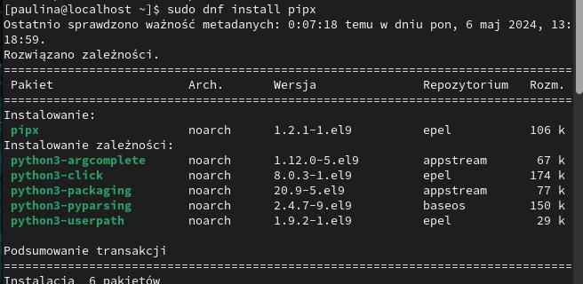
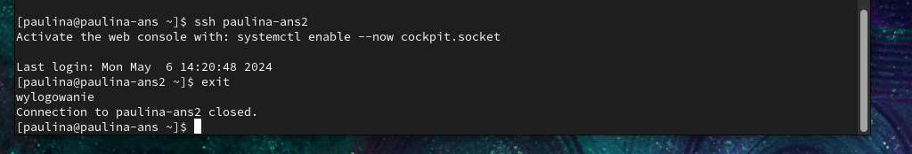
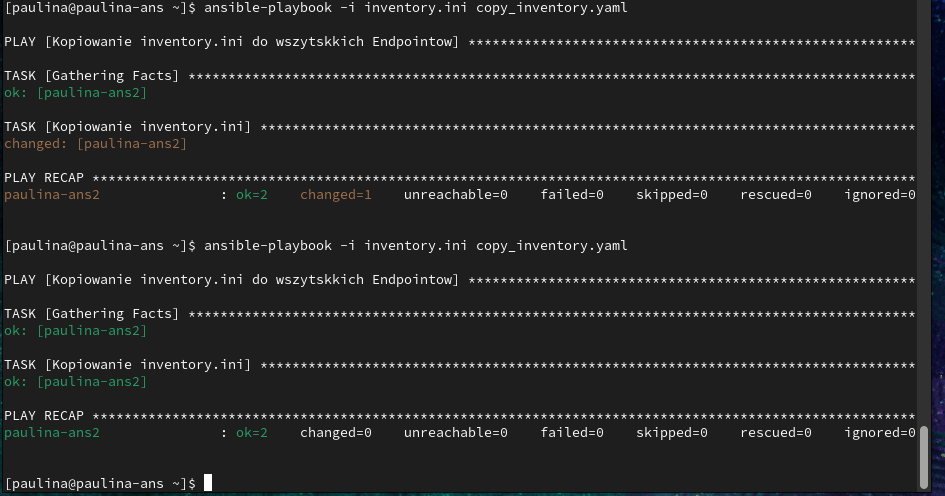

# Zajęcia 07
---
# Automatyzacja i zdalne wykonywanie poleceń za pomocą Ansible

### Instalacja zarządcy Ansible
* Utworzyłam dwie maszyny wirtualne:

* Zainstaluj oprogramowanie Ansible https://docs.ansible.com/ansible/latest/index.html

* Dokonaj inwentaryzacji systemów
  * Ustal przewidywalne nazwy komputerów stosując `hostnamectl`

  maszyna z ansible:

  

  druga:
  
  
  
  * Zweryfikuj łączność
  
  Poniewaz maszyny sa w sieci NAT nie moga ze soba sie komunikowac a wiec zamieniam na siec mostkowa:
  
  

  teraz komunikuja sie ze soba:
  

  * Wprowadź nazwy DNS dla maszyn wirtualnych tak, aby możliwe było wywoływanie komputerów za pomocą nazw, a nie tylko adresów IP, uzywjąć komendy: sudo nano /etc/hosts

  
  
   
  efekt:
  

  * Stwórz plik inwentaryzacji https://docs.ansible.com/ansible/latest/getting_started/get_started_inventory.html
    za pomoca komendy:  nano inventory.ini
  * Umieść w nim sekcje `Orchestrators` oraz `Endpoints`. Umieść nazwy maszyn wirtualnych w odpowiednich sekcjach

  

  

  * Wyślij żądanie `ping` do wszystkich maszyn.

   Ponieważ nie ma wymienionyh kluczy SSH, jedyne udane połączenie jest z localhost, bo jest to komunikajca do tej samej maszyny.
  

* Zapewnij łączność między maszynami

  Stworzenie i dodoanie klucza SSH:

  
  
  * Dokonaj wymiany kluczy między maszyną-dyrygentem, a końcówkami (`ssh-copy-id`)
  
  
  
  * Upewnij się, że łączność SSH między maszynami jest możliwa i nie potrzebuje haseł
  
  

### Zdalne wywoływanie procedur
  * Wyślij żądanie `ping` do wszystkich maszyn
  
   
  
  * Skopiuj plik inwentaryzacji na maszyny/ę `Endpoints`

  copy_inventory.ini:

  
  
  
  
  
  * Ponów operacje, porównaj różnice w wyjściu
  
  
  
  Zmiana jest w changed=0, poniewaz nic juz nie było zmienione dlatego nie ma 1.

  * Przeprowadź operacje względem maszyny z wyłączonym serwerem SSH, odpiętą kartą sieciową
 
  
  

  host nieosiagalny:
  
  

### Zarządzanie kontenerem
* Wykonaj, w zależności od dostępności obrazów:
  * Uruchom kontener sekcji `Deploy` z poprzednich zajęć
  * Pobierz z Docker Hub aplikację "opublikowaną" w ramach kroku Publish
  * Uruchom aplikację dostarczaną kontenerem Deploy/Publish, podłącz *storage* oraz wyprowadź port
   
   docker_rm.yaml:

   Na hoscie docelowym doinstalowalam docekra.

  

  * Zatrzymaj i usuń kontener

  

  