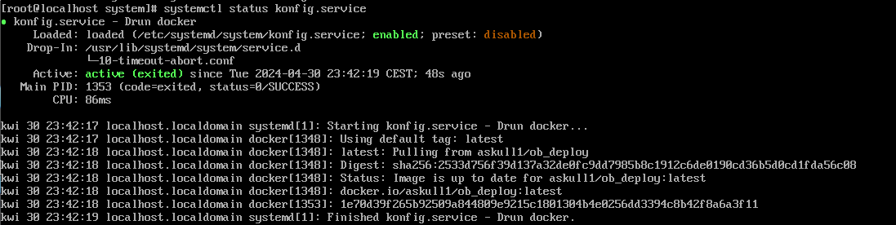

# Zajęcia 08
---
# Pliki odpowiedzi dla wdrożeń nienadzorowanych

## Zagadnienie
Niniejszy temat jest poświęcony przygotowaniu źródła instalacyjnego systemu dla maszyny wirtualnej/fizycznego serwera/środowiska IoT. Źródła takie stosowane są do zautomatyzowania instalacji środowiska testowego dla oprogramowania, które nie pracuje w całości w kontenerze
### Cel zadania
* Utworzyć źródło instalacji nienadzorowanej dla systemu operacyjnego hostującego nasze oprogramowanie
* Przeprowadzić instalację systemu, który po uruchomieniu rozpocznie hostowanie naszego programu

## Zadania do wykonania
Po sciagnieicu Fedory, aby skopiowac plik na nasz komputer musialam stworzyc dododatkowego uzytkownika, ktoremu przesłałam plik anaconda-ks.cfg. Po czym zmienilam własciciela plika za pomoca komendy sudo chown uztkownik anaconda-ks.cfg, dzięki czemu z komputera za pomca ssh moglam skopiowac ten plik do siebie.

Przygotowanie pliku anocnda-ks.cfg aby pobieral obraz oraz go uruchomil.
Zmiany w pliku odpowiedzi:
- w sekcji packages doanie instalcji docker
- dodanie repozytoriów dla systemu Fedora:
  * `url --mirrorlist=http://mirrors.fedoraproject.org/mirrorlist?repo=fedora-38&arch=x86_64`
  * `repo --name=update --mirrorlist=http://mirrors.fedoraproject.org/mirrorlist?repo=updates-released-f38&arch=x86_64`
- Plik odpowiedzi może zakładać pusty dysk. Zapewniamy, że zawsze będzie formatować całość, stosując `clearpart --all`

- Sekcja %post w konfiguracji kickstart jest używana do wykonywania poleceń po zainstalowaniu systemu.
Tworza jest nowa usługa systemd o nazwie konfig.service.
Jeśli wszystko przebiegnie pomyślnie, Docker zostanie skonfigurowany i uruchomiony automatycznie po zakończeniu instalacji systemu.

Przed reinstalcja trzeba plik wrzucic na server

oraz modyfikacja nosnika:

Efekt uruchomeinia:

