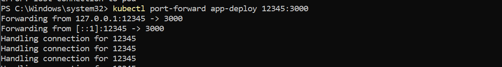

# Sprawozdanie 9
---
# Podstawy obsługi klastra Kubernetes

### Cel zadania
* Uruchomić lokalnie klaster Kubernetes
* Uruchomić na klastrze Kubernetes kontener Docker'a (z aplikacją z poprzednich laboratoriów)

## Zadania do wykonania
### Upewnij się że posiadasz zainstalowany klaster Kubernetes. 
Jeżeli już posiadasz Kubectl i Minikube

Instalacja Minikube:

oraz pobranie kubetcl

### Włącz i uruchom Minikube Dashboard. 
https://minikube.sigs.k8s.io/docs/handbook/dashboard/.

Wypisz listę zawierającą opis co można zrobić korzystając z Minikube Dashboard

### Uruchom kontener z aplikacją.
[odpowiadający "stage("Deploy") w Jenkinsfile] w Kubernetes:

Z uzyciem pods

Aby sprawdzić czy działa potrzebujesz dokonać przekierowania portów w celu umożliwienia dostępu z zewnątrz:

alternatywnie możesz skorzystać z sekcji czwartej dokumentacji Minikube (https://minikube.sigs.k8s.io/docs/start/) i użyć do tego celu polecenia "deployment":

### Udokumentuj że komunikator działa w klastrze Kubernetes. 
Efekt jest widoczny na stronie oraz w Dashboard.
